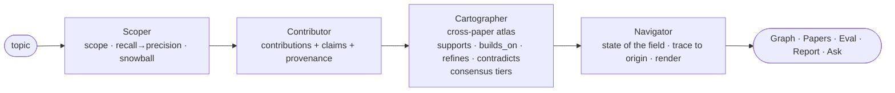

# Prior

> An open-source agentic system that reads primary literature and builds an
> **auditable contribution graph** — every claim traceable to its source, with
> contradictions surfaced and confidence made explicit — that you can query and
> navigate visually.

[](LICENSE)
[](https://www.python.org/)
[](https://github.com/Agents4Academia-AI/prior/actions/workflows/ci.yml)
[](https://github.com/Agents4Academia-AI/prior/releases/tag/v06.26)

**Team 6** (merged with Team 4): Klara · Harit
**Hackathon:** [Agents4Academia](https://agents4academia.github.io), 14–26 Jun 2026 · **Release `v06.26`**


*The atlas of "agents for the scientific process" — 152 papers · 581 contributions · 989
typed relations. Shown here as the **contribution graph** (nodes = contributions), then
**papers grouped into research communities**, then **papers on a timeline**.*

---

## Why Prior

### The problem

Ask most AI research tools a literature question and you get a fluent paragraph
synthesised from snippets — but not one you can **audit**: no easy way to see which
paper each statement came from, whether the sources actually agree, or how much to
trust it. For real research, that provenance *is* the product.

**Prior makes a different bet:** don't summarise, **build a graph**. Read primary
sources (OpenAlex + arXiv), extract each paper's *contributions* and *claims*
with their provenance, link them across the literature (supports / extends /
refines / **contradicts**), and reason over that structure. The atlas is also a
clean hand-off artifact: a structured, grounded corpus other tools can build on.

Longer term, a map of what's **claimed, contested, and missing** is the *substrate*
a research system needs to judge **which phenomena deserve attention and what
questions to ask of them** — the call that comes *prior* to any task. Prior doesn't
make that call yet; it makes it **auditable** for whoever (or whatever) does.

Prior ships as an **open tool to reuse and improve** — not just a demo. Build an atlas of your
own topic in one command (`prior build`), lift any single stage into your own project, and
send improvements back via PR.

---

## What it does & how

### Three commitments — provenance, contradictions, confidence

1. **Provenance.** Every contribution and claim is a node that links back to the
   paper (and, where cached, the exact supporting text) — one click from a
   statement to its source and DOI.
2. **Contradictions.** The Cartographer only links claims *across* papers, and
   flags `contradicts` edges automatically — genuine empirical clashes get
   surfaced instead of averaged into a bland summary.
3. **Confidence — made explicit.** Nodes and edges carry confidence (an extraction
   score + cross-model agreement), shown in the UI; a self-auditing eval *checks* how
   well-calibrated those numbers are, with a human-annotation track as the real
   cross-check (in progress). (Honest scope of what "confidence" means today: see
   [Roadmap & next steps](#roadmap--next-steps).)

### Architecture — one atlas, four agents

Prior builds a single **contribution atlas** over the source material (an earlier
design split it into per-paper "local" and cross-paper "global" layers; in the
end we shipped the cross-paper atlas as the product, with per-paper provenance
reachable from every node).



- **Scoper** — topic → a scoped corpus (recall-then-precision + citation
  snowball to saturation + completeness checks).
- **Contributor** — cached full text → each paper's contributions + claims, with
  extraction confidence and provenance.
- **Cartographer** — contributions across papers → the linked atlas: cross-paper
  `supports/extends/refines/contradicts` edges, consensus tiers, contradictions.
- **Navigator** — a question + the atlas → a grounded answer (cited to node ids),
  and the rendered views.

### The interface

Four views — **Graph · Papers · Eval · Report** (+ Ask Prior). The **Graph** is the
atlas above, animated through its lenses — communities, a playable timeline, and
per-cluster **knowledge frontiers** (expand a community into a lineage: foundational
work at the centre, the frontier at the rim):


### The flagship atlas — *agents for the scientific process*

Prior's flagship build maps **the hackathon's own field** — *agents for the
scientific process* — a fitting stress test: the tool mapping the literature it is
part of. It's the atlas in the GIF above.

| | |
|---|---|
| Papers | 152 |
| Contributions | 581 |
| Claims | 1,547 |
| Cross-paper relations | 989 — `supports` 695 · `builds_on` 212 · **`contradicts` 73** · `refines` 9 |
| Structure | **83%** of contributions sit in one connected component |
| Communities | Peer review · Autonomous systems · Hypothesis generation · Benchmarks & eval · Multi-agent orchestration · Domain-science agents · Idea novelty · RAG / literature QA · Safety / risk |

The **communities are emergent, not hand-drawn** — greedy-modularity clustering
(`networkx`) over the consensus relation edges, each labelled by a keyword vote
(deterministic, key-free — no LLM). In the **Communities** and **Timeline** views the
nodes are **papers**, which inherit their contributions' community.

The corpus spans the anchors — *The AI Scientist* (v1 & v2), *ResearchAgent*,
*NovBench* — and the **73 `contradicts` edges** surface genuine tensions. One the
atlas flags automatically:

> **"LLM reviewing-agents give useful, iterative peer review"** ⟂ **"LLM-as-judge
> scores for open-ended scientific ideation systematically exceed PhD-level expert
> ratings by 3–4 points"**

i.e. whether LLMs can reliably *evaluate* science is itself contested — exactly the
kind of open question Prior is built to surface.

---

## Does it hold up?

### Evaluation — the atlas audits itself

Prior ships a **self-auditing eval** (the `Eval` and `Report` views) that grades a
built atlas along three gates:

| gate | checks | self-eval |
|---|---|:--:|
| **Faithful** | extraction faithfulness · global-edge precision | ✓ |
| **Honest** | grounding (cited ids are real) · abstention (off-topic → `not_found`) · in-scope coverage | ✓ |
| **Useful** | novelty recall (finds related work) | ✓ |

On the atlas above, the interactive `Eval` view runs a **multi-judge** scorecard —
each model judge (Claude, Qwen, Gemma…) *and* human annotator scores Contributions /
Relations / Claims. Correctness runs ~**53–80%** on contributions and ~**63–85%** on
claims, but only **21–53% on relations** — quantifying that *relation extraction is
the weak link*. Plus **cross-judge agreement** and **calibration** diagrams
(reliability + accuracy-vs-coverage).

**Honest caveats:** the headline checks are **self-eval** — the system auditing its
own output, a smoke test, *not* independent proof; a parallel **human-annotation**
track (~140-item queue) is the real cross-check. And calibration is **built but not
yet populated** on the shipped core bundle (its prebuilt contributions carry no
confidence scores), so **ECE / reliability aren't computed there yet**. "All green"
means the self-audit is clean, not that the graph is proven correct.

### Honest limitations & failure modes

The Anthropic deliverable is a report on **model behaviour and failure modes** on
agentic-research tasks. Ours, plainly:

- **Direction is the noisiest signal.** *Whether* two claims are related, and *what
  type*, hold up better than *which way* `builds_on` points — so the viewer anchors
  precedence to publication **year** rather than the model's directional guess.
- **Confidence is model-agreement, not evidence weight** (see Roadmap → scope of
  confidence). A claim agreed on by 3 runs can still rest on one weak study.
- **Contradiction precision is imperfect.** The atlas flags 73 `contradicts` edges,
  but some are novelty-framing ("unlike prior work X…") mis-read as conflict — treat
  them as candidates to investigate, not verdicts (the eval puts relation correctness
  at just 21–53%). "Contradiction as its own agent" is a roadmap item.
- **Grounding is semantic, not verbatim.** Quotes are faithful paraphrases, not
  guaranteed exact spans — verification should treat them as such.
- **The corpus is query-shaped.** Papers are *relevance* hits for the exact
  query, so selection leans toward the asked relationship; report it as "papers
  most relevant to the question," not "the literature." `--cite-hops` reaches
  older foundational work relevance ranking buries.
- **The citation graph is incomplete.** arXiv reference lists are largely
  missing from the sources; intra-corpus citation coverage is sparse.
- **Contributions are self-proclaimed, not audited.** Prior extracts what each paper
  *claims* as its contribution and takes it at face value — it doesn't yet check the claim
  holds, reproduces, or isn't overstated. Read a contribution as "what the authors assert,"
  not "what's been verified."

---

## Use it

### Quickstart

Full runbook in **[docs/RUNNING.md](docs/RUNNING.md)**. Short version:

```bash
pip install -e ".[graph]"                     # core + local embeddings (no Neo4j server needed)

# ── see it in 10 seconds: the shipped atlas — no API key, no database ──
prior view --open                             # opens the bundled atlas as one HTML file

# ── build your own atlas of a topic (needs an LLM) ──
export PRIOR_LLM_BACKEND=claude-cli           # credit-free (Claude Code login); or set ANTHROPIC_API_KEY
prior build "diffusion models for planning"   # → data/atlas/atlas.json
prior view --open                             # → your atlas, one self-contained HTML viewer

# ── or the full web app (persistent + queryable) ──
pip install -e ".[graph,web]" && docker compose up -d   # adds the web API + Neo4j
prior serve --port 8078                        # then run the frontend (see RUNNING.md)
```

Tests + evals are key-free: `pytest -q` · `python evals/graph_eval.py groundedness`.
Contributing: **[CONTRIBUTING.md](CONTRIBUTING.md)**.

### Reusable stages

Prior's pipeline is three **standalone, independently usable stages** — and they've
already been reused *beyond* Prior: another hackathon team lifted **Explore** to scope
the corpus for their own project ([**UReKA**](https://github.com/Agents4Academia-AI/UReKA)),
and the full-text and extract stages have
obvious broader uses. Take whichever you need:

| stage | what it does | one command |
|---|---|---|
| **Explore** (agentic) | topic → scoped corpus (recall-then-precision + citation snowball to saturation) | `scripts/explore.py --topic "<in/out-of-scope def>"` |
| **Get full text** (deterministic) | DOIs / arXiv ids → clean cached full text, multi-source cascade | `scripts/get_fulltext.py --ids dois.txt` |
| **Extract** (LLM) | cached full text → contributions + claims + graph | `scripts/extract.py --select all` |

**Most reusable: the full-text stage.** Its free channels (arXiv, OpenAlex OA,
Unpaywall, preprint servers) need **no keys**. On sharing: metadata and the graph are
safe to redistribute, but raw full text isn't — closed-access papers are **cited, not
shipped** (mining is permitted, redistribution isn't), and we prefer open arXiv copies.
Details in **[SHARING.md](SHARING.md)**.

---

## Roadmap & next steps

Grouped by what each cluster improves:

**Trust & calibration — make the graph trustworthy.**
- **Evidence-weighted confidence (the headline).** Today confidence answers *"was this
  faithfully extracted, and do the models agree?"* — a per-node extraction score plus
  `triple`/`double`/`opus_only` model-agreement tiers, self-audited for calibration. It is
  **not yet** *"how strong is the evidence?"*. Next: calibrate a claim by the *strength and
  agreement of its evidence* (the IPCC/IPBES scheme, Mastrandrea et al. 2010), not just how
  many model runs concur.
- **Decompose relation extraction (the easiest win).** Relations are the weak link (21–53%).
  The Cartographer labels a contribution against ~6 candidates in one call; that batching
  raises the *relational complexity*, where LLMs degrade and don't recover with scale
  ([Fesser et al. 2026, *REL*](https://arxiv.org/abs/2604.12176)). Split into lower-arity
  calls — *is there a relation? · what type? · which direction?* — pairwise for the hard
  cases, and keep anchoring direction to publication year.
- **Contradiction as its own agent** — lift precision past the ~50% floor: the "significance
  everywhere vs. nowhere" selection problem, head-on.
- **Eval as a gate** — make the key-free eval scorecard a *blocking* CI check, so a PR that
  regresses faithfulness / grounding / relation numbers fails and quality only ratchets up.

**Coverage & sources — what's in the graph.**
- **Beyond papers** — generalise the `Paper` node to a typed `Source` (talk, blog, video,
  thread, preprint) with credibility-weighted provenance, so the atlas reflects the whole
  scholarly conversation, not just the archived record.
- **Negative & null results** — give each claim a polarity (positive / negative / null /
  mixed) so the atlas captures what *didn't* work, countering publication bias.
- **Citation-aware Cartographer** — once the citation graph is backfilled, use real citations
  to set relation direction and to check model-guessed edges.

**Structure & synthesis — the higher-level shape of a field.**
- **Contribution roll-up + establishedness** — surface the latent claim hierarchy (distinct
  leaves → broader synthesized claims), non-destructively, and compute a graph-derived
  *establishedness* from independent support (the ontology-trap risk is real — specced
  separately, staged and human-approvable).
- **Gap surfacing — a coverage view, not the graph.** Absence is invisible in a node-link
  layout; a method × task (or community × claim-type) matrix makes under-studied cells pop,
  plus a Navigator "what's under-supported?" query.

**Distribution — get it to people and agents.**
- **Hosted demo** — a public, STORM-style instance to try Prior without installing.
- **MCP server — Prior as an agent tool.** Expose the atlas over MCP so other agents can build
  and query it — the graph as agent-queryable long-term memory, not just a human UI.

Contributions welcome — start from any reusable stage above, see
[CONTRIBUTING.md](CONTRIBUTING.md), or open an issue. Design notes in [docs/](docs/);
progress log in `claude-progress.md`.

## End notes

### Credits

- **Klara Kaleb**
- **Harit Vishwakarma**
- **Yee Whye Teh**
- **Claude** — Claude Code, mostly Opus 4.8

Who-did-what and a candid human + Claude retrospective: **[RETRO.md](RETRO.md)**.

### Links

- **Slides:** [hackathon deck](https://docs.google.com/presentation/d/1ESDmlK8z3T8XWKAdn_xdJVWpP079jkP1iKCl95wjQLo/edit)
- **Demo:** run locally per the Quickstart (hosted instance planned)

### Acknowledgements

Built during [Agents4Academia](https://github.com/Agents4Academia-AI), 14–26 June
2026. Code **Apache-2.0**; graph/atlas data (`data/`) **CC-BY-4.0**.

**Related & inspired by:** [ORKG](https://orkg.org) (TIB Hannover) ·
[NLPContributionGraph](https://ncg-task.github.io/) (SemEval 2021) ·
[AutoSci](https://github.com/skyllwt/AutoSci) (knowledge-graph long-term memory) ·
FutureHouse [PaperQA2](https://github.com/Future-House/paper-qa) / Aviary ·
[Papers with Code](https://paperswithcode.co) (Meta → Hugging Face) ·
[scite.ai](https://scite.ai) (supporting / contradicting *Smart Citations*) ·
[Elicit](https://elicit.com) (Ought) · [STORM](https://github.com/stanford-oval/storm)
(Stanford) · [Connected Papers](https://www.connectedpapers.com) /
[ResearchRabbit](https://www.researchrabbit.ai) / [Litmaps](https://www.litmaps.com) ·
Open Knowledge Format (Google, 2026) · [OpenAlex](https://openalex.org) /
[arXiv](https://arxiv.org) / [Semantic Scholar](https://www.semanticscholar.org).
