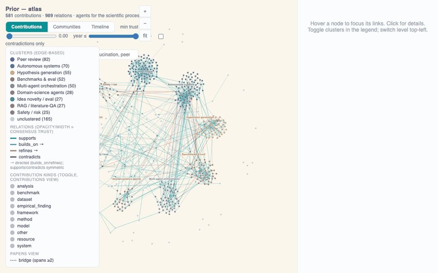
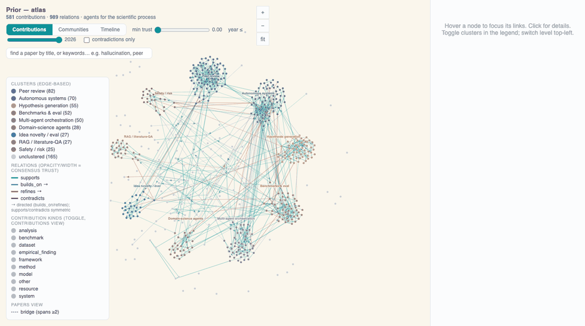

# Prior

> An open-source agentic system that reads primary literature and builds an
> **auditable contribution graph** — every claim traceable to its source, with
> contradictions surfaced and confidence made explicit — that you can query and
> navigate visually.

[](LICENSE)
[](https://www.python.org/)
[](https://github.com/Agents4Academia-AI/prior/actions/workflows/ci.yml)
[](https://github.com/Agents4Academia-AI/prior/releases/tag/v06.26)

**Team 6** (merged with Team 4): Klara · Harit
**Hackathon:** [Agents4Academia](https://agents4academia.github.io), 14–26 Jun 2026 · **Release `v06.26`**



*The atlas of "agents for the scientific process" — 152 papers · 581 contributions ·
989 typed relations — as the contribution graph, research communities, and a timeline.*

---

## Why Prior

Ask most AI research tools a literature question and you get a fluent paragraph
synthesised from snippets — but not one you can **audit**: no way to see which paper
each statement came from, whether the sources actually agree, or how much to trust
it. For real research, that provenance *is* the product.

**Prior makes a different bet: don't summarise, build a graph.** Read primary sources
(OpenAlex + arXiv), extract each paper's *contributions* and *claims* with their
provenance, link them across the literature (supports / builds_on / refines /
**contradicts**), and reason over that structure. A map of what's **claimed,
contested, and missing** is the substrate for judging which questions to ask next —
Prior doesn't make that call; it makes it **auditable** for whoever does.

**Why now.** When the hackathon's participants — working researchers — were asked
about their core workflow frustration, the most common answer was *"I can't keep up
with the literature."* And the standard instrument for keeping up is structurally
behind: citation graphs take months to form, while fast fields move in weeks. In
Prior's demo atlas, **nearly half of the relations connect papers published within
six months of each other** — too contemporaneous to cite one another, and therefore
invisible to citation-based tools like Connected Papers or Litmaps. Prior maps that
structure from the claims themselves, before the citation record catches up.

## Quickstart

Full runbook in **[docs/RUNNING.md](docs/RUNNING.md)**. Short version:

```bash
pip install -e ".[graph]"                     # core + local embeddings (no Neo4j server needed)

# ── see it in 10 seconds: the shipped atlas — no API key, no database ──
prior view --open                             # opens the bundled atlas as one HTML file

# ── build your own atlas of a topic (needs an LLM) ──
export PRIOR_LLM_BACKEND=claude-cli           # credit-free (Claude Code login); or set ANTHROPIC_API_KEY
prior build "diffusion models for planning"   # → data/atlas/atlas.json
prior view --open                             # → your atlas, one self-contained HTML viewer

# ── or the full web app (persistent + queryable) ──
pip install -e ".[graph,web]" && docker compose up -d   # adds the web API + Neo4j
prior serve --port 8078                        # then run the frontend (see RUNNING.md)
```

Tests + evals are key-free: `pytest -q` · `python evals/graph_eval.py groundedness`.
Contributing: **[CONTRIBUTING.md](CONTRIBUTING.md)**.

## How it works

One **contribution atlas**, four agents:


- **Scoper** — topic → a scoped corpus (recall-then-precision + citation snowball to
  saturation + completeness checks).
- **Contributor** — cached full text → each paper's contributions + claims, with
  extraction confidence and provenance.
- **Cartographer** — contributions across papers → the linked atlas: cross-paper
  relation edges, consensus tiers, contradictions.
- **Navigator** — a question + the atlas → a grounded answer (cited to node ids), and
  the rendered views.

Three commitments run through it: **provenance** (every node one click from its
source and DOI), **contradictions** (cross-paper clashes flagged, not averaged away),
and **confidence made explicit** (extraction score + cross-model agreement — *not yet*
evidence strength; see the [roadmap](ROADMAP.md)).

The UI has four views — **Graph · Papers · Eval · Report** (+ Ask Prior) — with
community, timeline, and per-cluster knowledge-frontier lenses:



*From **communities** to a **knowledge frontier**: one research community expanded
as a lineage — foundational work at the centre, the current frontier at the rim —
then a node opened to its statement, source paper, and supporting quote.*

## The flagship atlas — *agents for the scientific process*

Prior's flagship build maps **the hackathon's own field** — the tool mapping the
literature it is part of:

| | |
|---|---|
| Papers | 152 |
| Contributions | 581 · Claims 1,547 |
| Cross-paper relations | 989 — `supports` 695 · `builds_on` 212 · **`contradicts` 73** · `refines` 9 |
| Structure | **83%** of contributions in one connected component |
| Communities | Peer review · Autonomous systems · Hypothesis generation · Benchmarks & eval · Multi-agent orchestration · Domain-science agents · Idea novelty · RAG / literature QA · Safety / risk |

Communities are **emergent, not hand-drawn** (greedy-modularity over consensus edges,
keyword-vote labels — deterministic, no LLM). And the **73 `contradicts` edges**
surface genuine tensions; one the atlas flags automatically:

> **"LLM reviewing-agents give useful, iterative peer review"** ⟂ **"LLM-as-judge
> scores for open-ended scientific ideation systematically exceed PhD-level expert
> ratings by 3–4 points"**

— whether LLMs can reliably *evaluate* science is itself contested: exactly the kind
of open question Prior is built to surface.

## Does it hold up?

A **self-auditing eval** (the `Eval`/`Report` views) grades every atlas on three
gates — **Faithful** (extraction + edge precision), **Honest** (grounding · abstention ·
coverage), **Useful** (novelty recall). On the flagship atlas, a multi-judge scorecard
(Claude, Qwen, Gemma… + human annotators) puts correctness at ~**53–80%** on
contributions and ~**63–85%** on claims, but only **21–53% on relations** — quantifying
that *relation extraction is the weak link*. These are **self-evals** — a smoke test,
not independent proof; a ~140-item human-annotation track is the real cross-check.
Details: **[docs/EVAL.md](docs/EVAL.md)**.

**Limitations, honestly** (the Anthropic deliverable is a failure-modes report — ours):

- **Contributions are self-proclaimed, not audited** — we take papers at their word.
- **Grounding is semantic, not verbatim** — quotes are faithful paraphrases, not exact spans.
- **Relation direction is the noisiest signal** — the viewer anchors precedence to year instead.
- **Contradiction precision is imperfect** — some `contradicts` edges are novelty-framing
  misread as conflict; treat as candidates, not verdicts.
- **Confidence is model-agreement, not evidence weight** — 3 concurring runs ≠ strong evidence.
- **The corpus is query-shaped** — "most relevant to the question," not "the literature."
- **The citation graph is incomplete** — arXiv reference lists are largely missing.

## Reusable stages

Three **standalone stages** — already reused beyond Prior (team
[**UReKA**](https://github.com/Agents4Academia-AI/UReKA) lifted Explore to scope
their corpus). Take whichever you need:

| stage | what it does | one command |
|---|---|---|
| **Explore** (agentic) | topic → scoped corpus (recall-then-precision + citation snowball) | `scripts/explore.py --topic "<in/out-of-scope def>"` |
| **Get full text** (deterministic) | DOIs / arXiv ids → clean cached full text, multi-source cascade | `scripts/get_fulltext.py --ids dois.txt` |
| **Extract** (LLM) | cached full text → contributions + claims + graph | `scripts/extract.py --select all` |

The full-text stage's free channels (arXiv, OpenAlex OA, Unpaywall) need **no keys**.
Metadata and the graph are redistributable; raw closed-access full text is **cited,
not shipped** — see **[SHARING.md](SHARING.md)**.

## Roadmap

Full detail in **[ROADMAP.md](ROADMAP.md)** — headlines:

- **Trust & calibration** — evidence-weighted confidence (IPCC-style); decompose
  relation extraction; a dedicated contradiction agent; eval as a blocking CI gate.
- **Coverage & sources** — beyond papers (typed `Source` nodes); negative & null
  results; a citation-aware Cartographer.
- **Structure & synthesis** — contribution roll-up + establishedness; gap surfacing.
- **Distribution** — hosted demo; **MCP server** (the atlas as agent-queryable memory).

## Credits & links

**Klara Kaleb · Harit Vishwakarma · Yee Whye Teh · Claude** (Claude Code, mostly
Opus 4.8). Who-did-what and a candid human + Claude retrospective: **[RETRO.md](RETRO.md)**.
Slides: [hackathon deck](https://docs.google.com/presentation/d/1ESDmlK8z3T8XWKAdn_xdJVWpP079jkP1iKCl95wjQLo/edit).

Built during [Agents4Academia](https://github.com/Agents4Academia-AI), 14–26 June 2026.
Code **Apache-2.0**; graph/atlas data (`data/`) **CC-BY-4.0**.

**Related & inspired by:** [ORKG](https://orkg.org) (TIB Hannover) ·
[NLPContributionGraph](https://ncg-task.github.io/) (SemEval 2021) ·
[AutoSci](https://github.com/skyllwt/AutoSci) · FutureHouse
[PaperQA2](https://github.com/Future-House/paper-qa) / Aviary ·
[Papers with Code](https://paperswithcode.co) ·
[scite.ai](https://scite.ai) · [Elicit](https://elicit.com) ·
[STORM](https://github.com/stanford-oval/storm) ·
[Connected Papers](https://www.connectedpapers.com) /
[ResearchRabbit](https://www.researchrabbit.ai) / [Litmaps](https://www.litmaps.com) ·
Open Knowledge Format (Google, 2026) · [OpenAlex](https://openalex.org) /
[arXiv](https://arxiv.org) / [Semantic Scholar](https://www.semanticscholar.org).
