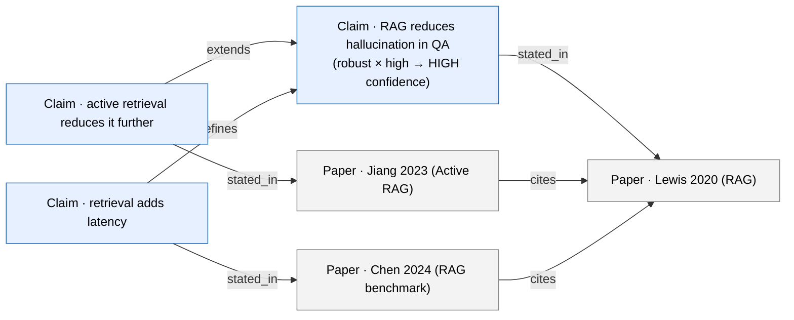
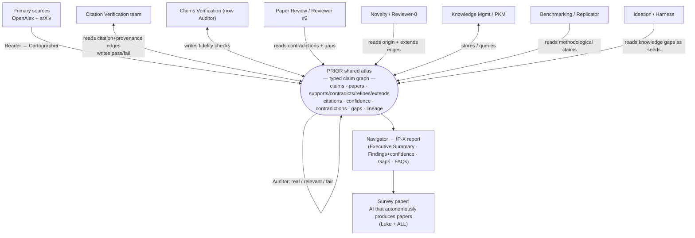

# Prior as the shared substrate — and why it's a graph, not a map

**Thesis (one line for the slide):** Prior is the *connective tissue* of the
hackathon — a single typed **claim graph** that every other agent reads from and
writes back to, and from which a human-readable **IP-X assessment report** is
rendered.

---

## 1. It's a graph, not a map

"Atlas" / "map" is the metaphor; the thing we actually build is a **directed,
typed, multi-relational knowledge graph**. The distinction matters:

| "Map" (what we're *not* building) | **Graph (what we are)** |
|-----------------------------------|--------------------------|
| A 2-D layout you browse / zoom | Nodes + **typed edges** you *traverse and query* |
| Position carries meaning | **Relations** carry meaning (supports, contradicts, …) |
| One picture | A queryable database: "show the contradiction subgraph", "trace this claim to its origin", "what extends X?" |
| Read-only artifact | A **shared state** agents read *and write* |

A map is the *rendering*; the graph is the *substrate*. The IP-X report is one
view rendered from the graph — like a chapter printed from a database.

---

## 2. The data model — how claims link together

Two kinds of node, several kinds of edge. Edges and nodes both carry attributes
(a *property graph*).

**Nodes**
- **Claim** — one atomic, calibrated assertion. Attributes: text, evidence span,
  `evidence_level × agreement_level → confidence` (IPCC calibration), likelihood,
  scope, `contested`, audit status.
- **Paper** — a primary source (OpenAlex / arXiv). Attributes: title, year,
  citation count.

**Edges**
| Edge | From → To | Meaning | Powers |
|------|-----------|---------|--------|
| `stated_in` | Claim → Paper | provenance — where the claim is made | grounding, citation honesty |
| `cites` | Paper → Paper | bibliographic citation (from OpenAlex) | **backward / origin tracing** |
| `supports` | Claim → Claim | evidence agrees | state-of-evidence, confidence |
| `contradicts` | Claim → Claim | evidence conflicts | **contradiction surfacing** |
| `refines` | Claim → Claim | adds conditions / narrows scope | nuance, scope |
| `extends` | Claim → Claim | builds further on | lineage, novelty |



ASCII fallback (same graph):

```
        extends                 refines
   C2 ───────────▶ C1 ◀─────────────── C3
   │               │                    │
   │stated_in      │stated_in           │stated_in
   ▼               ▼                    ▼
   P2 ───cites────▶ P1 ◀────cites────── P3

   C1  RAG reduces hallucination in QA      (robust × high  → HIGH confidence)
   C2  active retrieval reduces it further  (extends C1)
   C3  retrieval adds latency               (refines C1: scope/cost caveat)
```

The point: a "claim" is never a floating sentence — it is **anchored** to a
source (`stated_in`), **situated** among other claims (`supports / contradicts /
refines / extends`), and **dated** through the paper citation graph (`cites`),
which is what lets us walk *backward* to an idea's origin.

---

## 3. Prior as the shared output that joins everyone's agents

Luke's observation: the teams are each building a *different agent over the same
underlying object* — claims, citations, and their relations. If that object is a
shared graph, the agents compose instead of duplicating. Each team becomes a
**reader and/or writer of the atlas**.



ASCII fallback (hub-and-spoke):

```
   Citation Verif. ─┐        ┌─ Paper Review / Reviewer #2   (read: contradictions, gaps)
   Claims Verif. ───┤        ├─ Novelty / Reviewer-0         (read: origin, extends)
   (→ Auditor)      │        │
                    ▼        ▼
            ┌───────────────────────────┐
   sources ─▶│   PRIOR shared atlas      │──▶ Navigator ──▶ IP-X report ──▶ Survey paper
   (OpenAlex │   = typed CLAIM GRAPH     │                                  (Luke + ALL)
    + arXiv) │  claims·papers·relations  │
            └───────────────────────────┘
                    ▲        ▲
   Knowledge Mgmt ──┘        └─ Benchmarking / Ideation      (read: methods, gaps)
```

**Why this is the right shape:** today each agent re-reads PDFs and re-extracts
its own private claims. With a shared graph, extraction happens once; everyone
else consumes structured, audited claims and writes their verdicts back as new
edges/attributes. The graph is the interchange format.

---

## 4. The link to Luke's survey paper

The cohort already has a meta-goal: *a survey on using AI to autonomously produce
publishable papers (Luke + ALL).* Prior connects to it two ways:

1. **As an instance.** An IP-X report *is* an autonomously produced assessment /
   mini-survey, with calibrated confidence and traceable evidence — a concrete
   data point for the survey.
2. **As the organizing framework.** The survey can use Prior's graph as its
   taxonomy: each agent type (extract / verify citations / verify claims /
   review / judge novelty / synthesize) maps to a **node or edge operation** on
   the claim graph. That gives the survey a single coherent backbone instead of
   a loose list of tools — "here is the shared object; here is each agent as an
   operation on it."

**Slide takeaway:** *Prior turns the hackathon's parallel agents into one
pipeline over a shared claim graph — and that same graph is the backbone for the
survey.*
